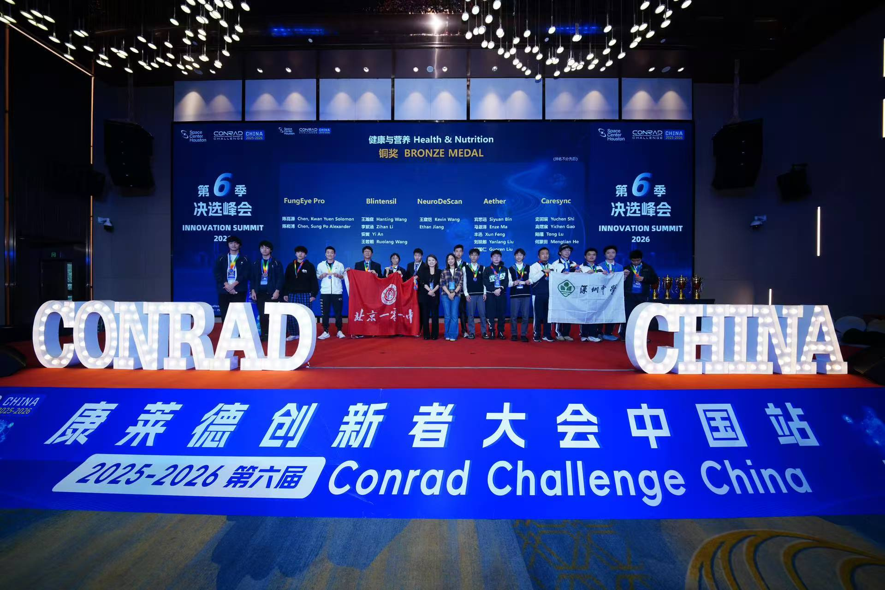
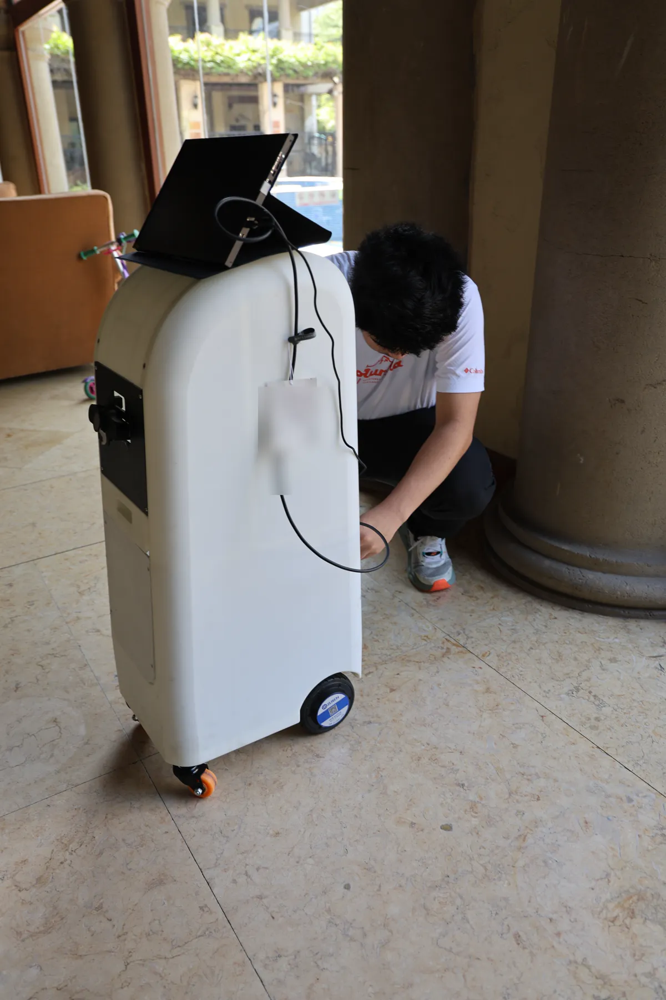
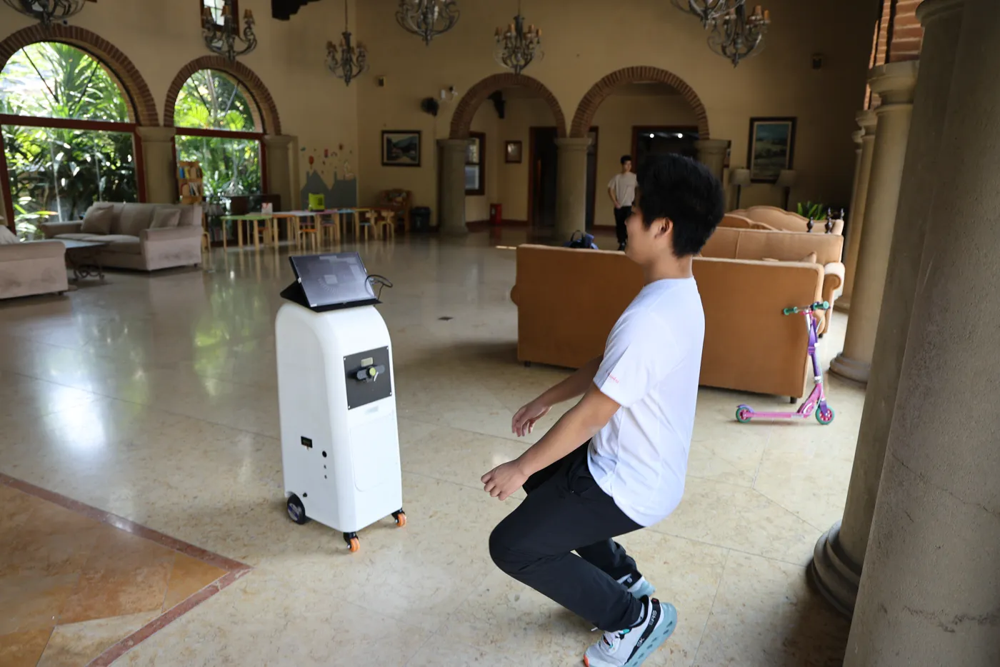
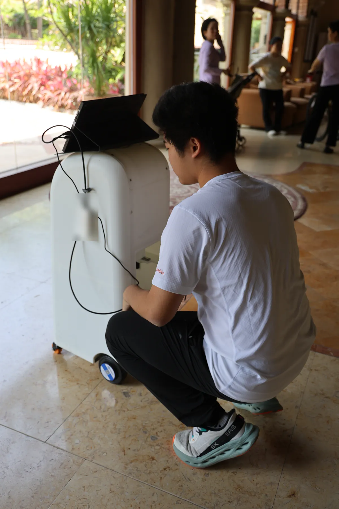
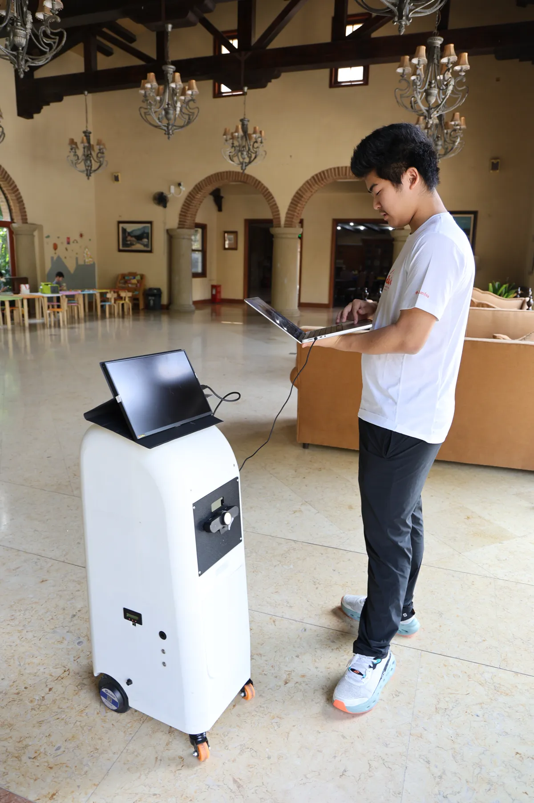
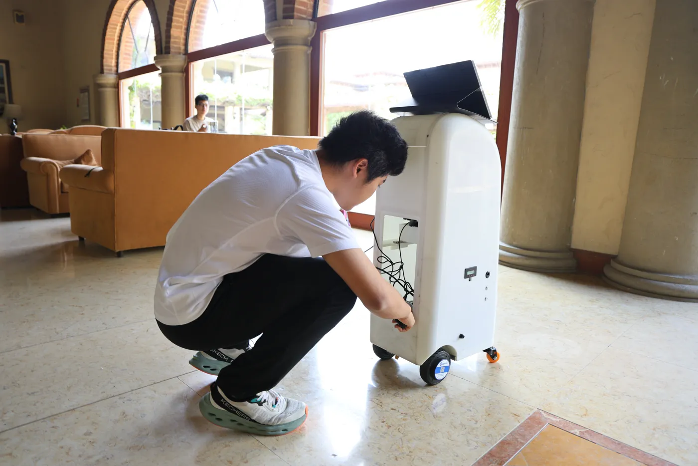
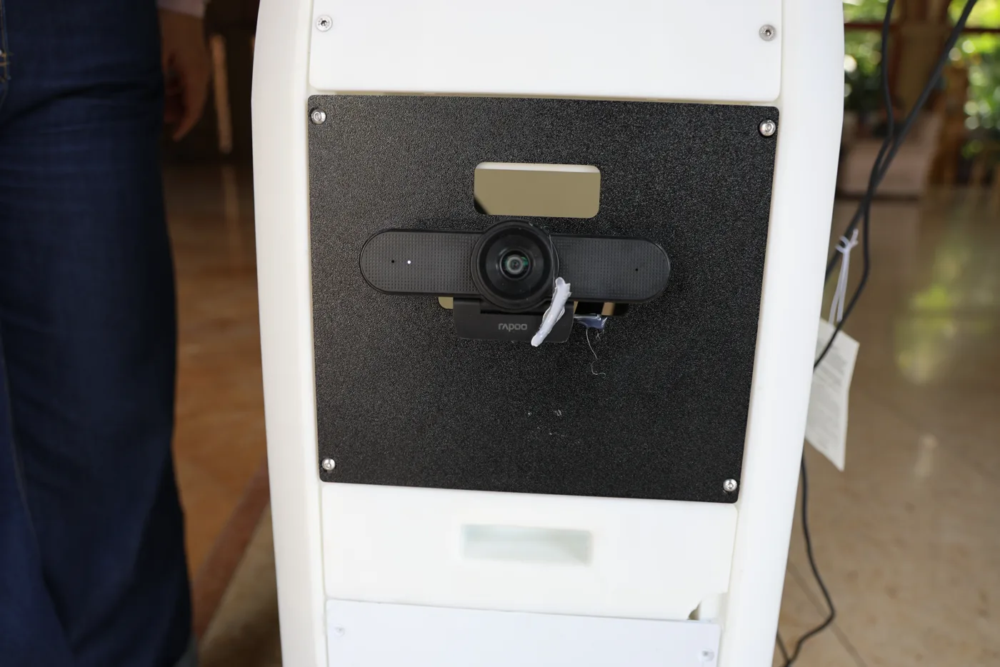
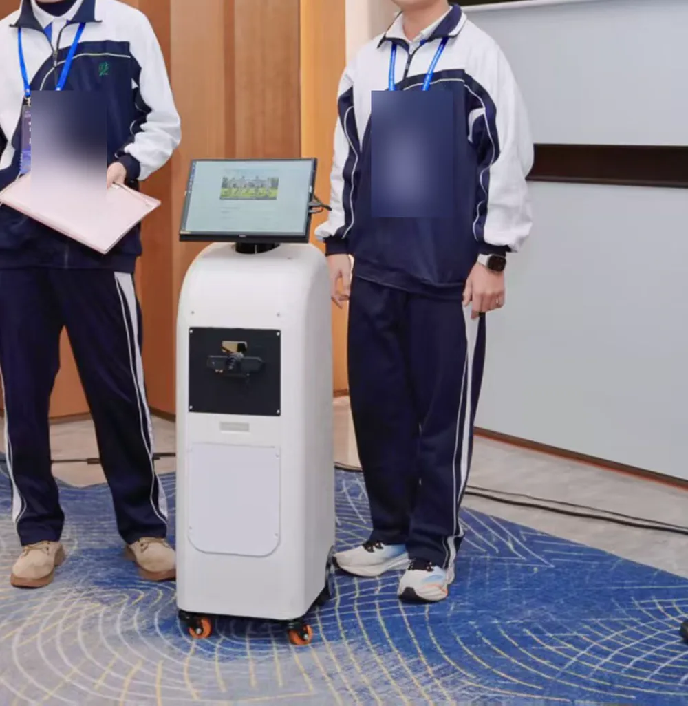

*The Conrad Challenge China finalists and the full awards stage.*

ElderGo came out of the interviews. Before there was a product there was a room
of people in a community care centre, most of them a good deal older than me,
being asked by a sixteen-year-old what was actually hard about their day. Three
answers kept coming back: the days are quiet, medication is easy to forget, and
a fall when nobody is home is the thing they are afraid of.

The order matters. The interviews came first and the product came second, not
the other way round.

So the product had three modules, and I split it that way:

- **Voice companionship** — something to talk to that does not get bored.
- **Fall detection** — the one that has to work.
- **Health and daily records** — so that a family member can see a pattern
  rather than being told everything is fine.

## Robot testing

These photographs document the team's testing rather than changing the division
of work described below: I did not build the hardware. They show the practical
conditions that the product framework had to meet — a full-size mobile body,
external displays, exposed connections and repeated stops to check what was not
working yet.

*A close check after the prototype stopped during testing.*

*The wider test made the distance between a person and the moving prototype visible.*

*A second stop to trace the problem from the rear of the body.*

## The team prototype

The assembled prototype combined a wheeled enclosed body, an external display,
a front-facing sensor cluster and rear access to the internal connections. It
was not a polished product, but it made the team's proposal concrete enough to
test and present.

*The complete prototype and the separate computer used while checking it.*

*Rear access exposed the cables and wheel assembly during debugging.*

*The front sensor assembly used for the prototype demonstration.*

## What I actually did

I set the technical framework: taking a vague idea and deciding what the parts
are, how they connect, and what a user does first, second and third. I designed
the interaction flow and the feature pages that came out of it.

Then I built the project's website — the product introduction, the analysis of
who this is for and what goes wrong for them today, the feature walkthrough and
the team page.

Around fifteen hours a week for twenty weeks, across two school years.

## The result

Bronze in the Health and Nutrition category. A hundred and sixty-nine teams
reached the final round.

*The prototype in the final presentation setting.*
