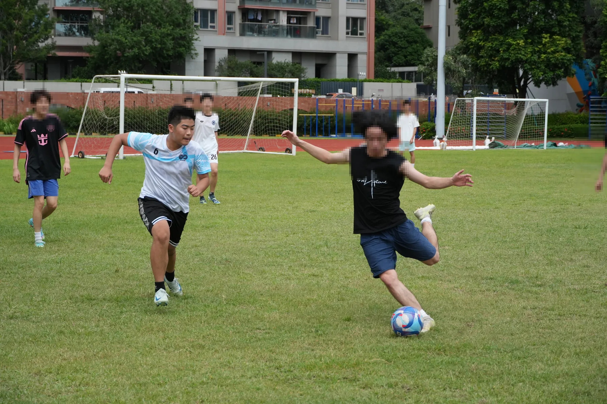
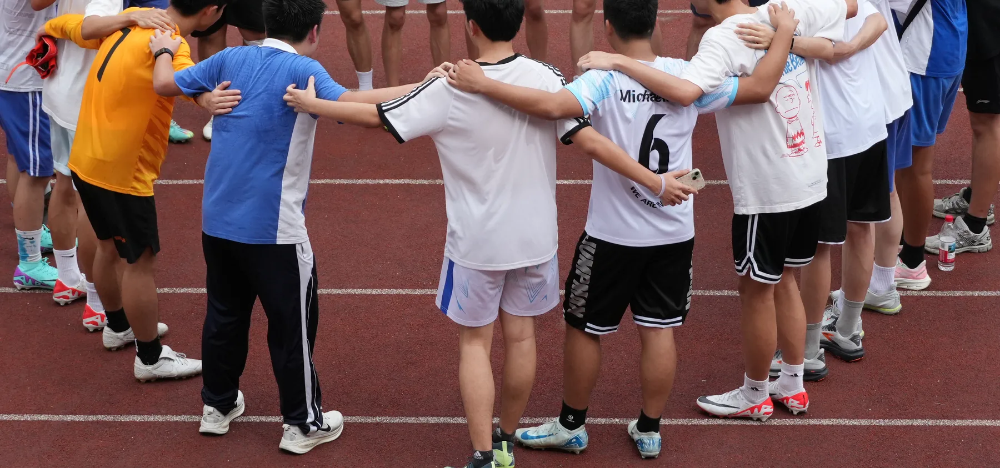
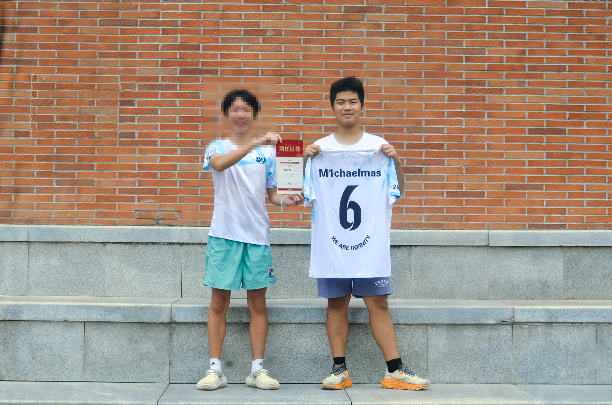

*Closing down the space before the next pass or shot.*

I play fullback for the school team. The job is to stop the winger in front of
you getting past, to mark and to intercept, and then — having done that — to
overlap and put a ball into the box anyway.

It is a position with no highlights reel. What it does teach is reading a
situation quickly: where to stand changes every few seconds depending on where
everyone else is, and standing in the wrong place is invisible until it is a
goal.

## The team around the position

A fullback's decision is never isolated. Stepping forward changes the space
behind me; staying back changes the passing option in front of me. Training is
therefore as much about learning the movement of the people around me as it is
about tackling or crossing.

*The shape of the huddle is kept; faces are outside the crop.*

*Number 6 and the team certificate.*

Four hours a week, ten weeks a year.

Classmates' faces are cropped or pixelated in the copies shown here. The
original photographs remain outside this repository.
