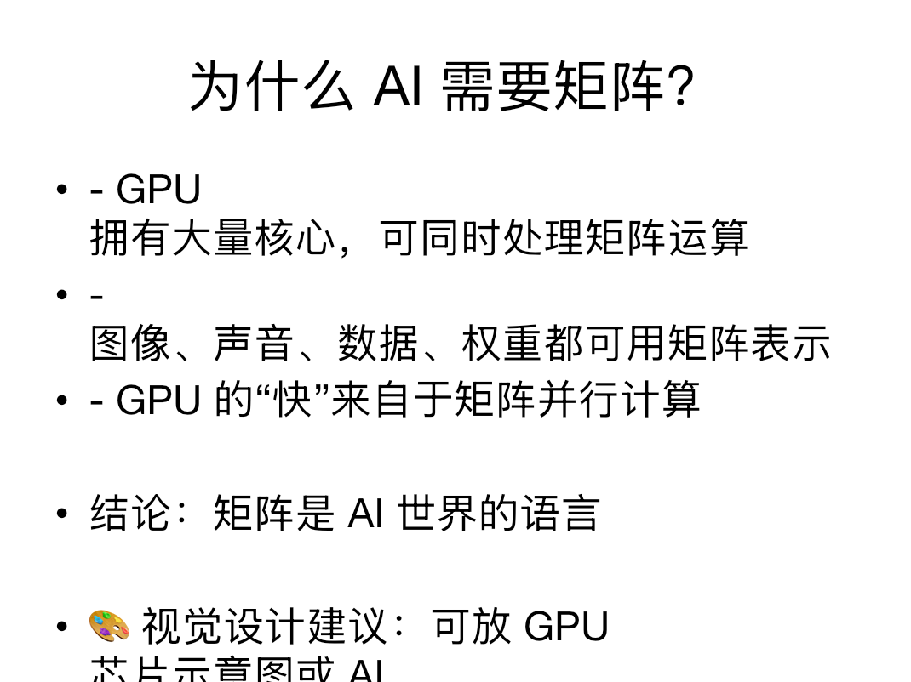
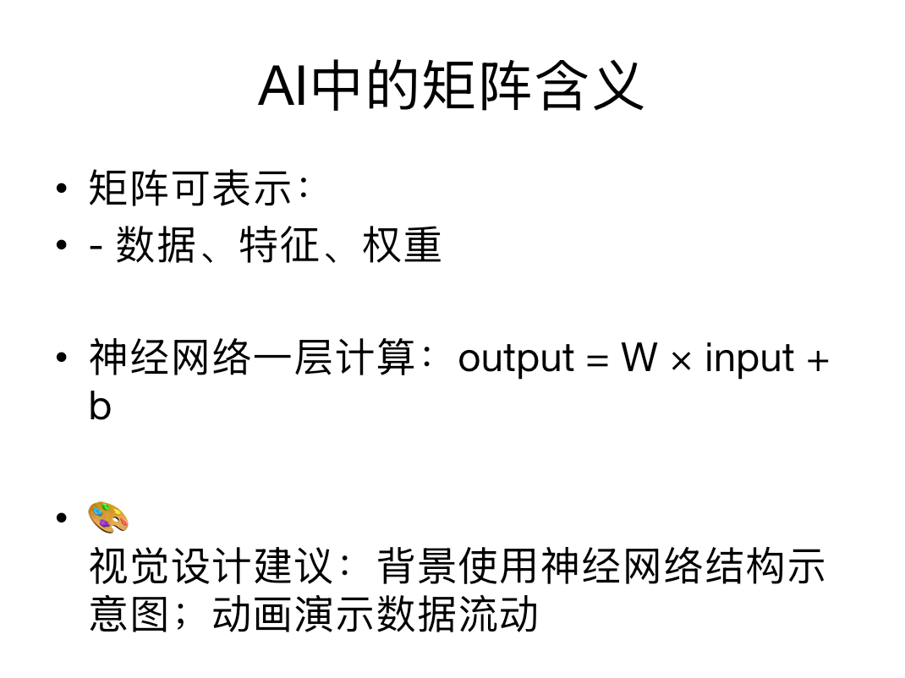

*A session begins at the board, before the mathematics is translated into code.*

I run the Turing Society, which means I decide what a year of it looks like and
then stand at the front and teach it. I do not start with a list of AI products.
I start with the mathematics that makes the next idea possible.

## Building the route into AI

The course moves from functions to vectors and matrices, then to the mechanics
of a neural network and simple image recognition. The aim is not to make the
mathematics disappear. It is to choose an order in which each abstraction becomes
necessary before I name it.

That means working examples through by hand, drawing the geometry on the board,
and only then connecting the same operations to NumPy or a model. A dot product
is first a comparison of two directions; later it becomes a way to compare two
feature vectors.

## Inside one lesson

The third lesson opens with one question: why is a GPU fast? Parallel computation
gives the class a reason to care about vectors and matrices before meeting their
formal definitions. From there, the lesson reaches matrix multiplication as a
weighted combination and then the operation inside a neural-network layer.

*The motivating question comes before the formal definition.*

*The abstraction becomes concrete in `output = W × input + b`.*

Students finish by calculating a two-dimensional dot product, multiplying a
2 × 2 matrix by a 2 × 1 vector, and asking how the same method could process one
thousand input vectors at once.

## What I actually do

I set the sequence for the year, prepare the explanations and exercises, and
teach the sessions myself. Around ten hours a week across seven weeks of the
year, counting preparation. Most of that time is preparation: deciding which
example will make the next difficult step feel earned rather than announced.
